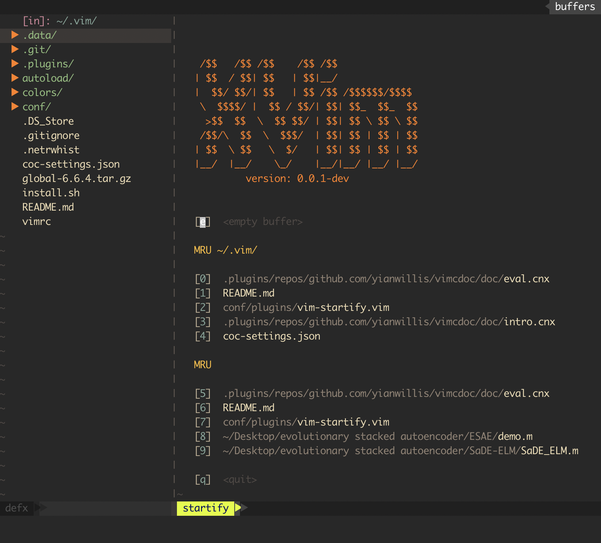

```
           /$$   /$$  /$$                                                       /$$    /$$ /$$
          | $$  / $$ | $$                                                      | $$   | $$|__/
  /$$$$$$ |  $$/ $$//$$$$$$    /$$$$$$   /$$$$$$  /$$$$$$/$$$$   /$$$$$$       | $$   | $$ /$$ /$$$$$$/$$$$
 /$$__  $$ \  $$$$/|_  $$_/   /$$__  $$ /$$__  $$| $$_  $$_  $$ /$$__  $$      |  $$ / $$/| $$| $$_  $$_  $$
| $$$$$$$$  >$$  $$  | $$    | $$  \__/| $$$$$$$$| $$ \ $$ \ $$| $$$$$$$$       \  $$ $$/ | $$| $$ \ $$ \ $$
| $$_____/ /$$/\  $$ | $$ /$$| $$      | $$_____/| $$ | $$ | $$| $$_____/        \  $$$/  | $$| $$ | $$ | $$
|  $$$$$$$| $$  \ $$ |  $$$$/| $$      |  $$$$$$$| $$ | $$ | $$|  $$$$$$$         \  $/   | $$| $$ | $$ | $$
 \_______/|__/  |__/  \___/  |__/       \_______/|__/ |__/ |__/ \_______/          \_/    |__/|__/ |__/ |__/
```
# TODO

## BUGS
- defx 文件浏览器里打开文件时莫名卡死 **Done**

## vim-startify
- sessions 相关

# 关于 eXtreme Vim(XVim)

eXtreme Vim 简称 XVim，以下使用 XVim 代替 eXtreme Vim，是我个人的 Vim 配置。
它通过一些插件来使 Vim 提供一个类 IDE 的编辑特性。

XVim 受到了 [SpaceVim](https://github.com/SpaceVim/SpaceVim) 的启发，但是其核心
思想和实现方式不同。

XVim 的核心思想是: 

- **记忆辅助，肌肉记忆为主**，所有快捷键，都需要用户自己记住，以肌肉记忆为主，
若是无法记起某个功能，则需要记忆 TODO:
- 可视化交互
- **唯我主义**，我不要你觉得，我要我觉得。XVim 里的所有特性都是以我个人喜好
  来决定的。
- **极简主义**，尽可能不增加复杂性，代码都通俗易懂。

XVim 的实现方式和 [SpaceVim](https://github.com/SpaceVim/SpaceVim) 有所不同，
SpaceVim 加入了层(layer)的概念，而 XVim 没有新增任何概念，使用的都是 Vim 固有的
概念，不会增加复杂性，方便用户微调。

# 需求

- Vim 版本 802 以上，因为有的插件要使用浮动窗口; 
- +python3，因为有的插件使用 python 开发的，python2 我没有测试，不知道能不能用; 

# 源码编译安装 Vim

## Mac(or Linux) -> Linux 没有测试，不知道行不行，如果有测试过的小伙伴，可以告诉我
```sh
git clone https://github.com/vim/vim.git
cd vim
./configure --with-features=huge \
            --enable-multibyte \
            --enable-rubyinterp \
            --enable-python3interp \
            --enable-perlinterp \
            --enable-luainterp \
            --enable-cscope \
            --enable-terminal \
            --enable-autoservername \
            --enable-luainterp
make -j4
sudo make install
```

更新版本

```sh
cd vim
git pull
make distclean
./configure --with-features=huge \
            --enable-multibyte \
            --enable-rubyinterp \
            --enable-python3interp \
            --enable-perlinterp \
            --enable-luainterp \
            --enable-cscope \
            --enable-terminal \
            --enable-autoservername \
            --enable-luainterp
make -j4
sudo make install
```

安装到 `/usr/local/bin/` 下。

# 特性

本配置使用 [dein](https://github.com/Shougo/dein.vim) 作为插件管理器。

## 启动界面


在启动界面中，左边是树状的文件浏览器，右边是欢迎界面。

欢迎界面中列出了当前文件夹
下常用的文件和全局常用的文件，可以使用 `h,j` 来选中然后按 `enter` 打开文件，也
可以按对应文件前面方括号里的字符来打开。

文件浏览器的功能: 
- `<leader>fl` 打开和关闭文件浏览器窗口
- `q` 关闭浏览器窗口
- `x` 用系统默认应用打开文件或文件夹
- `v` 垂直分割窗口并打开文件
- `s` 水平分割窗口并打开文件
- `t` 在新的标签页里打开文件
- `Ctrl + n + d` 新建目录
- `Ctrl + n + f` 新建文件
- `'` 选中或取消当前文件或文件夹
- `"` 选中或取消所有文件和文件夹
- `c` 取消当前选中的文件或文件夹
- `Ctrl + c` 复制当前的文件或文件夹
- `Ctrl + x` 剪切当前的文件或文件夹
- `Ctrl + v` 粘贴复制过的或剪切过的文件或文件夹
- `r` 重命名当前文件或文件夹
- `Del` 或 `Backspace` 删除光标下的文件或文件夹
- `yy` 复制光标下的文件或文件夹的路径
- `Enter` 光标下如果是文件，则打开，光标下如果是文件夹则展开或关闭
- `i` 进入当前光标下的文件夹
- `o` 返回上层文件夹
- `h` 让光标回到当前文件或文件夹所在的文件夹条目上，如果当前光标
所在是文件夹，并且其处于展开状态，则关闭当前文件夹，如果其处于
关闭状态，则返回当前文件夹的父目录上
- `~` 打开加目录
- `Ctrl + h` 切换显示隐藏文件
- `Ctrl + Shift + R`，对浏览器窗口进行重绘
- `Ctrl + g` 在命令行显示光标下的文件或文件夹的绝对路径
- `>` 增加当前窗口的宽度
- `<` 减少当前窗口的宽度


在头文件和源文件之间切换: `<leader>sh`

## Keymap

这个配置里的 Leader Key 设置为分号，即 `let mapleader=","`。

快捷保存与退出：
- `<leader>q` 退出当前窗口
- `<leader>w` 保存当前窗口
- `<leader>W` 退出所有窗口

分割窗口后在窗口之间的跳转：
```vim
nnoremap <Leader>lw <C-W>l
nnoremap <Leader>hw <C-W>h
nnoremap <Leader>jw <C-W>j
nnoremap <Leader>kw <C-W>k
```

和系统剪贴板的交互：
```vim
vnoremap <Leader>y "+y
nnoremap <Leader>p "+p
nnoremap <Leader>yy "+yy
```
插入日期:
```vim
" for insert date
nnoremap <Leader>id :r!date "+\%Y-\%m-\%d \%H:\%M"<CR>
imap <Leader>id <ESC><Leader>idkJA
```

# Plugins

## ctrlsf
```vim
" plugin: ctrlsf.vim
let g:ctrlsf_case_sensitive = 'smart'
nnoremap <Leader>sf :CtrlSF<CR>
```
